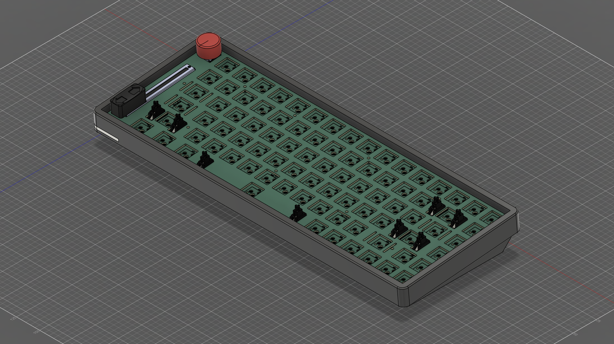

# NES-Style-Keyboard
- - - -

## Notice
- - - -
> [!IMPORTANT]  
> This Project is in its final stages. Some minor changes may be applied. It is advised that you wait before ordering parts and assembling the components.

## Description
- - - -
A friend of mine wanted to buy a keyboard. I convinced him to let me build him one. I decided to build him a custom 75% keyboard, with some extra features based on his preferences, and styled the color scheme to the popular NES. The whole keyboard, including the case, the main PCB, the switch plate and some of the caps, are custom designed by me.

## Features
- - - -
* Sliding Potentiometer
  * One of my friend's requests was to cater the keyboard more towards CAD design. The only right solution, in my opinion, is a sliding potentiometer for zoom control in apps like Fusion. The potentiometer can be remapped to another feature, like media volume control.
* Rotary Encoder
  * The rotary encoder serves as playback control (play/pause/previous/skip), but also as volume control. If volume control is already mapped by the potentiometer, the encoder can serve to switch audio channels controlled by the potentiometer (ex: switching from the music media channel to the system audio channel)
* Addressable RGB LEDs
  * A total of 6 WS2812b leds are included on the left hand side of the keyboard, right next to the sliding potentiometer. They indicate volume level (if controlled by the potentiometer) and/or caps lock.
* Repairable Design
  * The power supplied to the main PCB comes from a small daughterboard at the back, middle of the case. This daughterboard consists of a 3V3 LDO as well as a fuse. The two PCBs are connected to a standard 15cm (0.5ft) USB-C cable, allowing for a repairability by the user.
* Unibody Body Case
  * The case for the keyboard is as a unibody case. It is built to offer comfort, whilst keeping a thocky sound.
* Hot Swappable Keyswitches
  * Does this need to be explain at this point?

## Parts List
- - - -
|Part|*Price|*Shipping|Link|
|----|-----------|--------|----|
|Keycaps|$34.18|NaN|[XDA Retro NES Keycaps](https://www.aliexpress.com/item/1005007393936770.html?spm=a2g0o.order_list.order_list_main.25.587f1802SPZi3h)|
|Keyswitches (90pcs)|$32.18|NaN|[MMD Cream Switches (45G)](https://www.aliexpress.com/item/1005007083480212.html?spm=a2g0o.order_list.order_list_main.35.587f1802SPZi3h)|
|Hotswap Sockets (110ps)|$12.21|NaN|[110pcs Kailh Hot-swappable Sockets](https://www.aliexpress.com/item/1005007232040760.html?spm=a2g0o.order_list.order_list_main.30.587f1802SPZi3h)|
|Diodes|$3.17|NaN|[100pcs 1N4148W](https://www.aliexpress.com/item/1005009660071572.html?spm=a2g0o.order_list.order_list_main.20.587f1802SPZi3h)|
|Stabilizers|$25.99|NaN|[Durock Screw in Stabilizers V3 (Black)](https://www.aliexpress.com/item/1005003682325989.html?spm=a2g0o.order_list.order_list_main.10.587f1802SPZi3h)|
|USB-C Cable|$12.64|NaN|[6 inch USB C to USB C Cable (3 Pack)](https://www.amazon.ca/dp/B0CLLRBZDB)|
|BOM|$34.96|$8.00|[BOMs](production_files)|
|Main PCB|TBD|TBD| |
|Daughterboard|TBD|TBD| |
|Switch Plate|TBD|TBD| |
|Case|TBD|TBD| |

*All prices are in CAD, check in your own currency before buying.

## Quickstart
- - - -
Comming Soon

## Support
- - - -
Coming Soon

## Tools Used
- - - -
- [Kicad](https://www.kicad.org/)
- [Keyboard Layout Editor](https://www.keyboard-layout-editor.com/#/)
- [Autodesk Fusion](https://www.autodesk.com/products/fusion-360/overview)

## Legal Notice
- - - -
The software and hardware come as is. It is up to the user to review and make sure that they understand the scope of the project before ordering parts.
[GPL V2 License](LICENSE)
