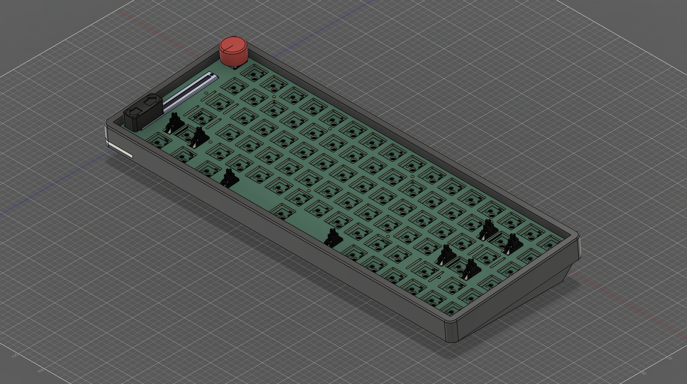

# NES-Style-Keyboard
- - - -


## Notice
- - - -
> [!IMPORTANT]  
> It is always advised that you review the files before ordering, as there may be small issues with the current revision.

## Description
- - - -
A friend of mine wanted to buy a keyboard. I convinced him to let me build him one. I decided to build him a custom 75% keyboard, with some extra features based on his preferences, and styled the color scheme to the popular NES. The whole keyboard, including the case, the main PCB, the switch plate and some of the caps, are custom designed by me.

## Gallery

## Features
- - - -
* Sliding Potentiometer
  * One of my friend's requests was to cater the keyboard more towards CAD design. The only right solution, in my opinion, is a sliding potentiometer for zoom control in apps like Fusion. To zoom using the slider, hold CTRL and move the slider up or down. To scroll horizontally, hold SHIFT and move the slider up or down.
* Rotary Encoder
  * The rotary encoder serves as playback control (play/pause/previous/skip), but also as volume control. If volume control is already mapped by the potentiometer, the encoder can serve to switch audio channels controlled by the potentiometer (ex: switching from the music media channel to the system audio channel)
* Addressable RGB LEDs
  * A total of 6 WS2812b leds are included on the left hand side of the keyboard, right next to the sliding potentiometer. They indicate volume level (if controlled by the potentiometer) and/or caps lock.
* Repairable Design
  * The power supplied to the main PCB comes from a small daughterboard at the back, middle of the case. This daughterboard consists of a 3V3 LDO as well as a fuse. The two PCBs are connected through a standard 15cm (0.5ft) USB-C cable, allowing for easy replacement by the user.
* Unibody Body Case
  * The case for the keyboard is as a unibody case. It is built to offer comfort, whilst keeping a thocky sound (it does sound awesome).
* Hot Swappable Keyswitches
  * Does this need to be explain at this point?

## Default keymaps
```
# Base Layer
[_BASE] = LAYOUT(
        KC_ESC, KC_F1, KC_F2, KC_F3, KC_F4, KC_F5, KC_F6, KC_F7, KC_F8, KC_F9, KC_F10, KC_F11, KC_F12, KC_HOME, KC_END, KC_PAUSE,
        KC_GRV, KC_1, KC_2, KC_3, KC_4, KC_5, KC_6, KC_7, KC_8, KC_9, KC_0, KC_MINS, KC_EQL,                    KC_BSPC, KC_INS,
        KC_TAB,     KC_Q, KC_W, KC_E, KC_R, KC_T, KC_Y, KC_U, KC_I, KC_O, KC_P, KC_LBRC, KC_RBRC,               KC_BSLS, KC_DEL,
        KC_CAPS,        KC_A, KC_S, KC_D, KC_F, KC_G, KC_H, KC_J, KC_K, KC_L, KC_SCLN, KC_QUOT,                 KC_ENT, KC_PGUP,
        KC_LSFT,            KC_Z, KC_X, KC_C, KC_V, KC_B, KC_N, KC_M, KC_COMM, KC_DOT, KC_SLSH, KC_RSFT,        KC_UP, KC_PGDN,
        KC_LCTL,    KC_LGUI,    KC_LALT,            KC_SPC,                   KC_RALT, MO(_FL), KC_RCTL, KC_LEFT, KC_DOWN, KC_RIGHT
    )

#Fn Layer
[_FL] = LAYOUT(
        _______, KC_PWR, KC_F2, KC_BRIU, KC_BRID, KC_F5, KC_MSEL, KC_F7, KC_F8, KC_F9, KC_F10, KC_F11, KC_F12, _______, _______, KC_SLEP,
        _______, _______, _______, _______, _______, _______, _______, _______, _______, _______, _______, UG_SPDD, UG_SPDU,              _______, UG_NEXT,
        _______, _______, _______, _______, _______, _______, _______, _______, _______, _______, _______, _______, _______, _______, UG_PREV,
        _______, _______, _______, _______, _______, _______, _______, _______, _______, _______, _______, _______,     _______, UG_SATU,
        _______, _______, _______, _______, _______, _______, _______, _______, _______, _______, _______, _______,     UG_VALU, UG_SATD,
        _______,    _______,    _______,            _______,                    _______, _______, _______, UG_HUED, UG_VALD, UG_HUEU
    )
```

## Parts List
- - - -
|Part|*Price|*Shipping|Link|
|----|-----------|--------|----|
|Keycaps|$34.18|NaN|[XDA Retro NES Keycaps](https://www.aliexpress.com/item/1005007393936770.html?spm=a2g0o.order_list.order_list_main.25.587f1802SPZi3h)|
|Keyswitches (90pcs)|$32.18|NaN|[MMD Cream Switches (45G)](https://www.aliexpress.com/item/1005007083480212.html?spm=a2g0o.order_list.order_list_main.35.587f1802SPZi3h)|
|Hotswap Sockets (110ps)|$12.21|NaN|[110pcs Kailh Hot-swappable Sockets](https://www.aliexpress.com/item/1005007232040760.html?spm=a2g0o.order_list.order_list_main.30.587f1802SPZi3h)|
|Diodes|$3.17|NaN|[100pcs 1N4148W](https://www.aliexpress.com/item/1005009660071572.html?spm=a2g0o.order_list.order_list_main.20.587f1802SPZi3h)|
|Stabilizers|$25.99|NaN|[Durock Screw in Stabilizers V3 (Black)](https://www.aliexpress.com/item/1005003682325989.html?spm=a2g0o.order_list.order_list_main.10.587f1802SPZi3h)|
|USB-C Cable|$12.64|NaN|[6 inch USB C to USB C Cable (3 Pack)](https://www.amazon.ca/dp/B0CLLRBZDB)|
|BOM|$34.96|$8.00|[BOMs](production_files)|
|Main PCB|$31.20|$43.78**|[Main PCB](production_files/gerbers_to_order_main)|
|Daughterboard|$3.00|$43.78**|[Daughterboard PCB](production_files/gerbers_to_order_secondary)|
|Switch Plate****|$0.00|NaN|[Plate PCB](production_files/gerbers_to_order_plate)|
|Case|$65.13|$43.78**|[Enclosure](production_files/3D_files/)|
|Misc.|$6.50***|$43.78**|[Misc. Parts](production_files/3D_files/)|

Total (excluding import fees): $298.66

* All prices are in CAD, check in your own currency before buying.
** Combined shipping for keyboard and daughterboard PCB, misc. items and enclosure.
*** Includes encoder knob, slider handle, power led bar and status bar
**** I decided to print the switchplate at home, since it was much cheaper per unit and overall compared to ordering it (price will be updated soon).

## Quickstart
- - - -
### 1) First flash
This step if for first flash, right after assembling your PCBs:
1) Download the UF2 prebuilt firmware in [firmware](firmware/).
2) Connect main board to daughterboard through USB-C intercable (**never connect a USB-C cable directly to the main PCB, it will damage the board**).
3) Press and hold EN button on keyboard.
4) Plug USB-C cable from computer to daughterboard, and let go of the EN button.
5) A USB device will appear in your file explorer, drag and drop UF2 file from your downloads folder into the USB device.
6) If the keyboard automatically resets, the flash was successful. Otherwise, try flashing again.

### 2) Reflash
Since the EN button is on the opposite side of the board and not accessible once the keyboard is assembled, I added a key combo that resets the board and enables flashing new firmware:
1) Press and release right CTRL, ESC, left CTRL and END button at the same time.
2) Drag and drop UF2 firmware from your computer onto the keyboard.
3) If the keyboard automatically resets, the flash was successful. Otherwise, try flashing again (step 1).

## Support
- - - -
Coming Soon

## Tools Used
- - - -
- [Kicad](https://www.kicad.org/)
- [Keyboard Layout Editor](https://www.keyboard-layout-editor.com/#/)
- [Autodesk Fusion](https://www.autodesk.com/products/fusion-360/overview)

## Legal Notice
- - - -
The software and hardware come as is. It is up to the user to review and make sure that they understand the scope of the project before attempting the project.
[GPL V2 License](LICENSE)
